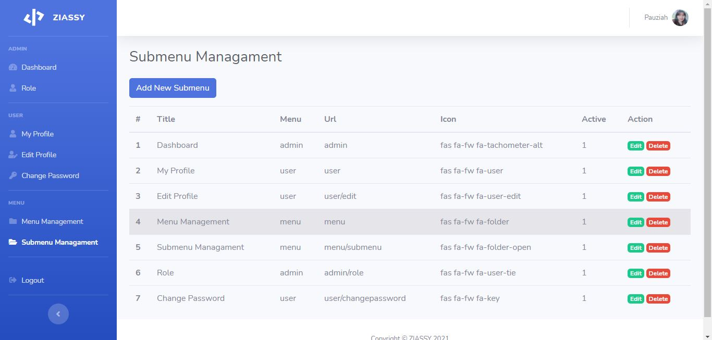

# Login-management-system
⌨ Login Management System With Codeigniter

Fitur Login yang memiliki akses ke 2 role yang berbeda yaitu User dan Admin

### Fitur In Login Management System 
- __Dashboard__ 
- __Role__ 
- __My Profile__ 
- __Edit Profile__ 
- __Change Password__ 
- __Menu Management__ 
- __Submenu Management__ 
- __Logout__ 

---

### Built With
- [Codeigniter](https://www.codeigniter.com/)
- [Bootstrap](https://getbootstrap.com/)
- [SB Admin 2](https://startbootstrap.com/theme/sb-admin-2)
- [PHP](https://www.w3schools.com/php/)

### Created By
- [Pauziah](https://github.com/ziassy)

### Screenshot

---

### Get in Touch 

- Twitter: [@ziassy](https://twitter.com/ZIASSY1)
- Instagram : [@fauziiyaa_](https://www.instagram.com/fauziiyaa_/)
- Email : [pauziahid@gmail.com](mailto:pauziahid@gmail.com)
- Telegram : [Ziassy](https://t.me/ziassy)

### Buy me a Cup of Tea Or Donation🍺

- OVO : 085887322352
- Paypal :[ziassy](https://www.paypal.me/ziassy)

---

###### tags: `PHP` `Codeigniter`
